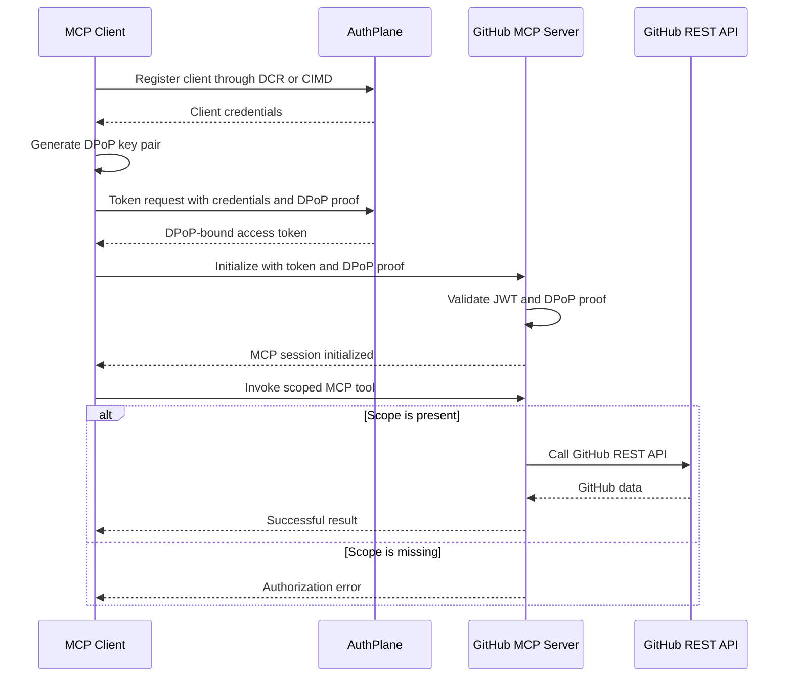

```

### Components

- **MCP Client** registers through DCR or identifies itself through CIMD.
- **AuthPlane** issues OAuth access tokens and publishes signing keys.
- **GitHub MCP Server** validates authentication and checks tool scopes.
- **GitHub REST API** supplies repository and user data.

## OAuth Client Credentials and DPoP sequence



## Request validation order

For every protected MCP request, the server checks:

1. An access token is present.
2. A DPoP proof is present.
3. The JWT signature is trusted.
4. The issuer matches AuthPlane.
5. The audience matches the MCP resource URI.
6. The token has not expired.
7. The DPoP key matches the token.
8. The DPoP method and URI match the request.
9. The DPoP proof has not been replayed.
10. The token contains the required tool scope.
